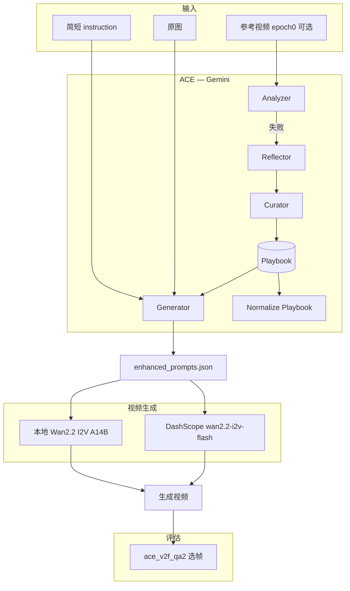

# ace_i2v_basic

**ACE-based Image-to-Video (I2V) pipeline for Human-Object Interaction (HOI)**  
将简短 HOI 指令增强为详细视频生成 prompt，用 Playbook 从失败中持续学习，并对接 Wan2.2 图生视频与 QA2 选帧评估。

本仓库是精简、可独立发布的工具包：核心逻辑在 `scripts/`，文案与 Playbook 种子在 `data/`，一键编排见 `run_minimal.sh`。

---

## 目录

- [功能概览](#功能概览)
- [整体架构](#整体架构)
- [目录结构](#目录结构)
- [环境要求](#环境要求)
- [安装](#安装)
- [配置](#配置)
- [数据准备](#数据准备)
- [快速开始](#快速开始)
- [流水线详解](#流水线详解)
- [脚本说明](#脚本说明)
- [中英文文案 (cn / en)](#中英文文案-cn--en)
- [视频生成：API 与本地 A14B](#视频生成api-与本地-a14b)
- [输出产物](#输出产物)
- [常见问题](#常见问题)
- [引用与致谢](#引用与致谢)

---

## 功能概览

| 能力 | 说明 |
|------|------|
| **ACE Playbook 学习** | 用 Gemini 分析参考视频失败案例，增量更新 strategies / templates / pitfalls |
| **Prompt 增强** | Generator 结合原图 + 指令 + Playbook 生成 `enhanced_prompt` |
| **Playbook 整理** | 学习结束后自动 normalize（防/避类条目归位、补全编号） |
| **Wan2.2 I2V** | DashScope API 或本地 [Wan2.2 I2V A14B](https://github.com/Wan-Video/Wan2.2) 生成视频 |
| **QA2 选帧** | 两次 VLM 调用：生成完成态 Yes/No 问题 + 在均匀采样帧中选最优帧 |
| **双语 Prompt** | `ACE_LANG=cn|en` 切换 Playbook 种子、角色 prompt、视频 wrap、QA2 prompt |

---

## 整体架构



**ACE 四角色**（`ace_i2v_official3.py`）：

1. **Generator** — 读 Playbook，产出详细视频 prompt  
2. **Analyzer** — 判断视频是否完成指令  
3. **Reflector** — 将具体失败抽象为通用洞察  
4. **Curator** — 将洞察增量写入 Playbook（ADD，不重写整本）

---

## 目录结构

```
ace_i2v_basic/
├── README.md                 # 本文件
├── requirements.txt          # Python 依赖
├── setup_env.sh              # 创建 venv 并安装依赖
├── env.example               # 环境变量模板 → 复制为 env.local
├── run_minimal.sh            # 主流程：learn → enhance → wan22 → qa2
├── run_wan22_local_a14b.sh   # 仅本地 Wan2.2 A14B 批量生成
├── data/
│   ├── playbook_seed_cn.json / playbook_seed_en.json   # Playbook 种子
│   ├── ace_prompts_cn.json   / ace_prompts_en.json       # ACE 角色 system prompt
│   ├── qa2_prompts_cn.json   / qa2_prompts_en.json     # QA2 选帧 prompt
│   └── wan22_wrap_cn.json    / wan22_wrap_en.json        # 视频生成前后缀
├── scripts/
│   ├── ace_i2v_official3.py          # ACE 核心（Gemini + 可选 DashScope I2V）
│   ├── ace_i2v_locale.py             # cn/en 文案加载
│   ├── ace_v2f_qa2.py                # QA2 两次 VLM 选帧
│   ├── wan22_generate_from_enhanced_prompts.py   # DashScope 批量 I2V
│   ├── wan22_local_i2v_a14b_generate.py        # 本地 A14B 批量 I2V
│   └── wan22_prompt_tasks.py         # enhanced_prompts JSON 解析与 wrap
├── output/                   # 默认产出目录（git 可忽略）
└── logs/                     # 运行日志
```

---

## 环境要求

- **Python** 3.10+（推荐 3.11 / 3.12）
- **API**
  - [Google Gemini API](https://ai.google.dev/)（`GEMINI_API_KEY`）— ACE 学习与 QA2
  - [阿里云 DashScope](https://help.aliyun.com/zh/model-studio/)（`DASHSCOPE_API_KEY`）— 仅在使用 API 版 Wan2.2 时需要
- **本地 Wan2.2（可选）**
  - 克隆 [Wan-Video/Wan2.2](https://github.com/Wan-Video/Wan2.2)
  - 下载 **Wan2.2-I2V-A14B** 权重
  - CUDA GPU（推荐）或已适配的 NPU 环境
- **系统**：macOS / Linux；Windows 未专门测试

---

## 安装

```bash
cd ace_i2v_basic

# 创建虚拟环境并安装依赖
./setup_env.sh

# 配置密钥（不要提交 env.local）
cp env.example env.local
# 编辑 env.local，填入 GEMINI_API_KEY、DASHSCOPE_API_KEY 等

source env.local
# 或: source .venv/bin/activate
```

依赖见 `requirements.txt`：`google-genai`、`dashscope`、`opencv-python-headless`、`tqdm` 等。

---

## 配置

复制 `env.example` 为 `env.local` 后设置：

| 变量 | 必填 | 说明 |
|------|------|------|
| `GEMINI_API_KEY` | ACE / QA2 | Google Gemini API |
| `DASHSCOPE_API_KEY` | API 版 Wan2.2 | DashScope；`WAN22_BACKEND=local` 时可不填 |
| `ACE_LANG` | 否 | `cn`（默认）或 `en`，切换全部外置 prompt 与 Playbook 种子 |
| `DATA_ROOT` | 否 | 标注 JSON、原图、参考视频根目录（见下文） |
| `WAN22_BACKEND` | 否 | `dashscope`（默认）或 `local` |
| `WAN22_REPO` | 本地 I2V | Wan2.2 源码路径 |
| `WAN22_CKPT_DIR` | 本地 I2V | Wan2.2-I2V-A14B 权重目录 |
| `HTTP_PROXY` / `HTTPS_PROXY` | 否 | 访问 Gemini 时的代理 |

`run_minimal.sh` 会自动 `source env.local`（若存在）。

---

## 数据准备

流水线默认通过 `DATA_ROOT` 读取数据（可在 `env.local` 中修改）。典型布局：

```
DATA_ROOT/
├── collected_annotations_bboxes_v7_L1L2_questions.json   # 任务列表
├── collected_annotations_bboxes_v7_L3_questions.json
├── data_v7_L12/          # L1L2 原图（png，文件名与 JSON key 一致）
├── data_v7_L3/           # L3 原图
├── epoch_0_L1L2/         # Round1 学习用参考视频（mp4）
└── epoch_0_L3/
```

**标注 JSON 格式**（每条样本）：

```json
{
  "sample_id.png": {
    "instruction": "pick up the cup on the table"
  }
}
```

**enhanced_prompts 输出格式**（`enhance` 阶段生成，供 Wan2.2 读取）：

```json
{
  "_meta": { "format": "by_split" },
  "L1L2": {
    "sample_id.png": {
      "instruction": "...",
      "enhanced_prompt": "详细英文或中文视频描述..."
    }
  },
  "L3": { ... }
}
```

本仓库**不包含**大规模图像/视频数据集；公开代码时请自行准备数据或提供下载说明，并在 `.gitignore` 中忽略 `output/`、`logs/`、`env.local`、`.venv/`。

---

## 快速开始

```bash
source env.local

# 调试：每个 split 只跑 2 条
LIMIT=2 ./run_minimal.sh all

# 分步执行
./run_minimal.sh learn      # epoch0：从参考视频学 Playbook
./run_minimal.sh enhance    # 用 Playbook 生成 enhanced_prompt
./run_minimal.sh wan22      # Wan2.2 生成视频
./run_minimal.sh qa2        # QA2 选帧（可选）

# 英文 Playbook + 英文 ACE/QA2 prompt
ACE_LANG=en ./run_minimal.sh all

# 本地 Wan2.2 A14B（需权重与 Wan2.2 仓库）
WAN22_BACKEND=local ./run_minimal.sh wan22
```

跳过已完成步骤：

```bash
SKIP_LEARN=1 ./run_minimal.sh enhance
SKIP_QA2=1 ./run_minimal.sh all
FORCE_REGEN=1 ./run_minimal.sh wan22   # 不跳过已有 mp4
```

---

## 流水线详解

### 1. `learn` — Playbook 学习（epoch0）

- 脚本：`ace_i2v_official3.py --mode epoch0_only`
- 输入：原图 + instruction + **参考视频**（`epoch_0_*`）
- 流程：Analyzer 分析视频 → 失败则 Reflector + Curator 更新 Playbook
- 输出：`output/playbook.json`，以及 `output/playbook_normalized.json`（自动整理）
- 种子：从 `data/playbook_seed_{ACE_LANG}.json` 复制

### 2. `enhance` — 增强 prompt

- 脚本：`ace_i2v_official3.py --mode enhance_prompts_only`
- 输入：原图 + instruction + 学好的 Playbook（优先用 `playbook_normalized.json`）
- 输出：`output/enhanced_prompts.json`（合并 L1L2 + L3）

### 3. `wan22` — 图生视频

**API 版**（默认）：

```bash
python scripts/wan22_generate_from_enhanced_prompts.py \
  --enhanced-prompts-json output/enhanced_prompts.json \
  --image-dir-l1l2 "$DATA_ROOT/data_v7_L12" \
  --image-dir-l3 "$DATA_ROOT/data_v7_L3" \
  --output-dir-l1l2 output/wan22_videos/L1L2 \
  --output-dir-l3 output/wan22_videos/L3
```

**本地 A14B 版**：

```bash
./run_wan22_local_a14b.sh
# 或
WAN22_RUN_MODE=inprocess LIMIT=2 ./run_wan22_local_a14b.sh
```

### 4. `qa2` — 选帧评估

- 脚本：`ace_v2f_qa2.py`
- 从生成视频中均匀抽 15 帧，两次 Gemini 调用完成选帧
- 输出：每样本一张 PNG 到 `output/qa2_frames/L1L2` 等

---

## 脚本说明

| 脚本 | 作用 |
|------|------|
| `run_minimal.sh` | 主编排器 |
| `ace_i2v_official3.py` | ACE 全流程；`--mode`：`epoch0_only` / `enhance_prompts_only` / `full_pipeline` |
| `ace_v2f_qa2.py` | QA2 选帧；支持 `--shard-index` / `--num-shards` 并行 |
| `wan22_generate_from_enhanced_prompts.py` | DashScope `wan2.2-i2v-flash` |
| `wan22_local_i2v_a14b_generate.py` | 本地 WanI2V A14B；`--mode inprocess|subprocess` |
| `ace_i2v_locale.py` | 加载 `data/*_{cn|en}.json` |

**ace_i2v_official3 常用参数**：

```bash
python scripts/ace_i2v_official3.py \
  --mode epoch0_only \
  --json-path path/to/tasks.json \
  --image-dir path/to/images \
  --original-video-dir path/to/reference_videos \
  --playbook-file output/playbook.json \
  --ace-lang cn \
  --limit 10 \
  --trace-dir logs/traces_L1L2
```

---

## 中英文文案 (cn / en)

通过 `ACE_LANG` 或 `--ace-lang` 切换，**无需改 Python 代码**：

| 文件 | 用途 |
|------|------|
| `playbook_seed_cn.json` / `playbook_seed_en.json` | 初始 Playbook（26 strategies + 42 pitfalls） |
| `ace_prompts_cn.json` / `ace_prompts_en.json` | Generator / Analyzer / Reflector / Curator |
| `qa2_prompts_cn.json` / `qa2_prompts_en.json` | QA2 Call1 / Call2 + 选帧规则 |
| `wan22_wrap_cn.json` / `wan22_wrap_en.json` | 视频 prompt 固定前缀/后缀 |

学习得到的 Playbook 语言与当次 `ACE_LANG` 一致；若要中英两套并行，请使用不同 `PLAYBOOK` / `output` 目录分别运行。

---

## 视频生成：API 与本地 A14B

| 方式 | 环境变量 | 优点 | 缺点 |
|------|----------|------|------|
| **DashScope API** | `WAN22_BACKEND=dashscope` | 免 GPU、部署简单 | 需付费 API、网络依赖 |
| **本地 A14B** | `WAN22_BACKEND=local` | 可复现、无 API 限流 | 需 GPU/NPU、大权重、环境复杂 |

本地模式参考 [Wan2.2 官方 generate.py](https://github.com/Wan-Video/Wan2.2)：

- **inprocess**：一次加载模型，循环生成（适合单卡 CUDA）
- **subprocess**：每条调用 `generate.py`（适合多卡 NPU + FSDP）

NPU 多卡示例：

```bash
WAN22_RUN_MODE=subprocess \
WAN22_LAUNCHER=torchrun WAN22_NPROC=8 \
WAN22_SUBPROCESS_EXTRA="--dit_fsdp --t5_fsdp --cfg_size 2 --ulysses_size 4 --vae_parallel" \
./run_wan22_local_a14b.sh
```

---

## 输出产物

| 路径 | 内容 |
|------|------|
| `output/playbook.json` | 学习后的原始 Playbook |
| `output/playbook_normalized.json` | 整理后的 Playbook（推荐用于 enhance） |
| `output/enhanced_prompts.json` | 全量 enhanced prompt |
| `output/wan22_videos/L1L2/*.mp4` | API 或本地生成的视频 |
| `output/wan22_local_a14b/` | 本地 A14B 视频（若使用 local） |
| `output/qa2_frames/` | QA2 选出的代表帧 PNG |
| `logs/` | 各阶段日志、epoch0 per-sample trace |

---

## 常见问题

**Gemini 连接失败**  
检查 `GEMINI_API_KEY`、代理设置；可设置 `ACE_I2V_RESPONSE_SCHEMA=0` 关闭结构化 JSON schema。

**learn 阶段跳过大量样本**  
确认 `epoch_0_*` 下存在与 `image_name` 匹配的 mp4（支持 `:` / `_`  stem 变体）。

**enhance 很慢**  
每条样本调用 Gemini + 传图；用 `LIMIT` 调试，或分 split 跑。

**本地 Wan2.2 import 失败**  
在 Wan2.2 环境中安装其 `requirements.txt`；设置 `WAN22_REPO` 指向源码根目录。

**不要提交密钥**  
将 `env.local`、`.venv/`、`output/` 加入 `.gitignore`。

---

## 引用与致谢

- **Wan2.2**：[Wan-Video/Wan2.2](https://github.com/Wan-Video/Wan2.2) — 图生视频基座模型  
- **ACE (Agentic Context Engineering)**：Playbook 增量学习思路  
- **Google Gemini**：多模态推理与 QA2  
- **DashScope Wan2.2 I2V**：云端 `wan2.2-i2v-flash` API  

---

## License

发布前请在本目录添加 `LICENSE` 文件并写明授权方式。第三方模型与 API 的使用须遵守各自服务条款与模型许可。

如有问题或改进建议，欢迎通过 GitHub Issues 反馈。
